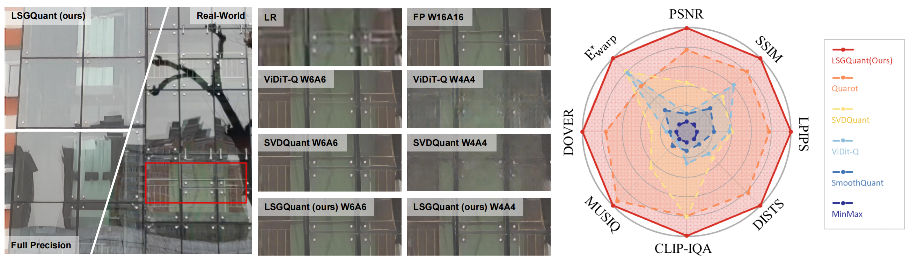
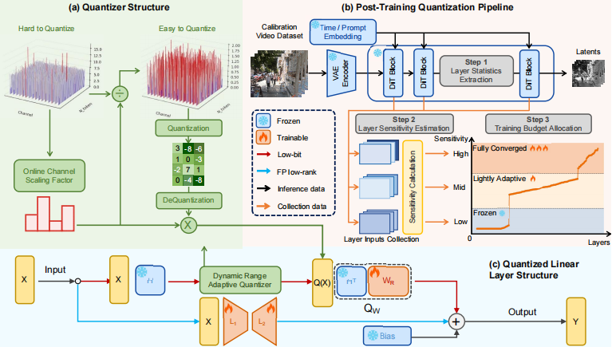
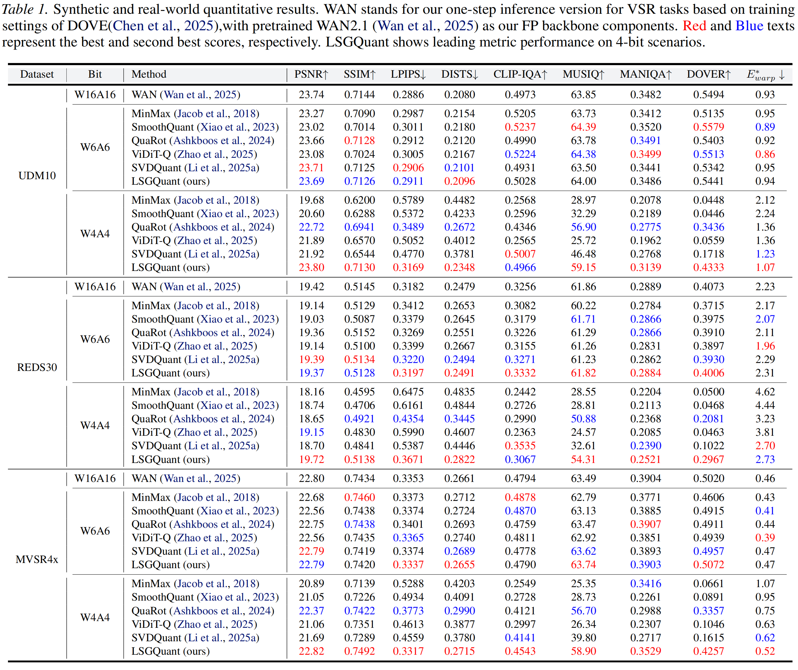
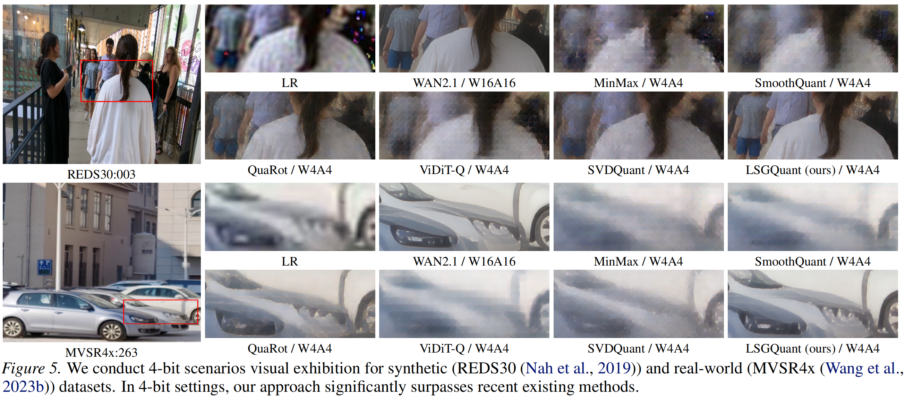

# LSGQuant: Layer-Sensitivity Guided Quantization for One-Step Diffusion Real-World Video Super-Resolution

[Tianxing Wu](https://github.com/wutianxing0626) *, [Zheng Chen](https://zheng-chen.cn/) *, [Cirou Xv](https://github.com/xucirou), [Bowen Chai](https://github.com/bowenchai), [Yong Guo](https://www.guoyongcs.com/), [Yutong Liu](https://isabelleliu630.github.io/), [Linghe Kong](https://www.cs.sjtu.edu.cn/~linghe.kong/), and [Yulun Zhang](http://yulunzhang.com/)†

"LSGQuant: Layer-Sensitivity Guided Quantization for One-Step Diffusion Real-World Video Super-Resolution", arXiv, 2026

<div>
<a href="https://github.com/zhengchen1999/LSGQuant/releases" target='_blank' style="text-decoration: none;"></a>
<a href="https://github.com/zhengchen1999/LSGQuant" target='_blank' style="text-decoration: none;"></a>
<a href="https://github.com/zhengchen1999/LSGQuant/stargazers" target='_blank' style="text-decoration: none;"></a>
</div>

[[project](https://zheng-chen.cn/LSGQuant/)] [[arXiv]()] [[supplementary material](https://github.com/zhengchen1999/LSGQuant/releases/download/supplement-v1/Supplementary_Material.pdf)]


#### <a name="news"></a>🔥🔥🔥 News

- **2026-02-??:** This repo is released.

---

> **Abstract:** One-Step Diffusion Models have demonstrated promising capability and fast inference in video super-resolution (VSR) for real-world. Nevertheless, the substantial model size and high computational cost of Diffusion Transformers (DiTs) limit downstream applications. While low-bit quantization is a common approach for model compression, the effectiveness of quantized models is challenged by the high dynamic range of input latent and diverse layer behaviors. To deal with these challenges, we introduce LSGQuant, a layer-sensitivity guided quantizing approach for one-step diffusion-based real-world VSR. Our method incorporates a Dynamic Range Adaptive Quantizer (DRAQ) to fit video token activations. Furthermore, we estimate layer sensitivity and implement a Variance-Oriented Layer Training Strategy (VOLTS) by analyzing layer-wise statistics in calibration. We also introduce Quantization-Aware Optimization (QAO) to jointly refine the quantized branch and a retained high-precision branch. Extensive experiments demonstrate that our method has nearly performance to origin model with full-precision and significantly exceeds existing quantization techniques.



---

### Method Overview



---

## <a name="todo"></a>⚒️ TODO

* [ ] Release code and pretrained models
* [ ] Test our quantization method on more models


## <a name="results"></a>🔎 Results

<details open>
<summary>Quantitative Results (click to expand)</summary>

- Results in Tab. 1 of the main paper

<p align="center">
  
</p>
</details>

<details open>
<summary>Qualitative Results (click to expand)</summary>

- Results in Fig. 5 of the main paper

<p align="center">
  
</p>
</details>

## <a name="citation"></a>📎 Citation

If you find the code helpful in your research or work, please cite the following paper(s).

```
@inproceedings{???}
```

## <a name="acknowledgements"></a>💡 Acknowledgements

The full-precision backbone model is adapted from [WAN2.1](https://github.com/Wan-Video/Wan2.1). We extend our thanks to its developers for providing a robust pretrained baseline, which significantly supports LSGQuant.

The quantization framework builds upon [ViDiT-Q](https://github.com/thu-nics/ViDiT-Q) and [SVDQuant](https://github.com/nunchaku-ai/nunchaku). We also express our gratitude to these open-source contributors, whose code has been instrumental in the development and experimentation of LSGQuant.
